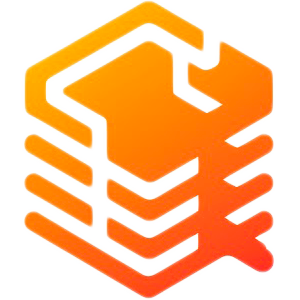

<strong>Markdown Documentation with Vitamins</strong>

    <a href="https://github.com/atmgrupomaggioli/docshub/tree/main/docshub#docshub---core" target="_blank">
        Get Started
    </a>
    &nbsp;❖&nbsp;
    <a href="https://github.com/atmgrupomaggioli/docshub/tree/main/docker" target="_blank">
        Get Started with Docker
    </a>
    &nbsp;❖&nbsp;
    <a href="https://docshub.vercel.app">
        Demo
    </a>
    &nbsp;❖&nbsp;
    <a href="#-features">
        Features
    </a>
    &nbsp;❖&nbsp;
    <a href="#-contributors">
        Contributors
    </a>

> [!WARNING]
> DocsHub is still in development. You cannot clone the repository yet. Alternatively, you can try it with [Docker](https://github.com/atmgrupomaggioli/docshub/tree/main/docker).

## 🧑‍🚀 Introduction

DocsHub is a **self-hosted** application designed to make documentation effortless. Just focus on writing in Markdown, and let DocsHub handle the rest.

## ✨ Features

- **Syntax Highlighting with Copy Function**: Easily view and copy code snippets directly from the documentation.
- **Friendly URLs**: Clean and user-friendly URLs for better navigation and sharing.
- **Table of Contents**: Automatically generated table of contents for quick and easy access to different sections.
- **Categorized Menu**: Organized menu structure to easily navigate through different categories and sections.
- **Search Documentation**: Quickly find and navigate to specific entries within the documentation.
- **Endpoint Documentation**: Ability to document API endpoints for better clarity and usage.
- **Alerts**: Option to document using an alert component for important messages.

## 📚 Documentation

You can check the Docshub documentation [here](https://docshub.vercel.app/). This documentation also serves as a live demo of the application.

## 🙏 Support

If you experience any bugs or problems, please use the **Issues section** of the repository to report them. You can create a [new issue](https://github.com/atmgrupomaggioli/docshub/issues/new/choose).

Thank you for helping us improve! 😊

## 🤝 Contributors

<!-- ALL-CONTRIBUTORS-LIST:START - Do not remove or modify this section -->
<!-- prettier-ignore-start -->
<!-- markdownlint-disable -->
<!-- markdownlint-restore -->
<!-- prettier-ignore-end -->

<!-- ALL-CONTRIBUTORS-LIST:END -->

