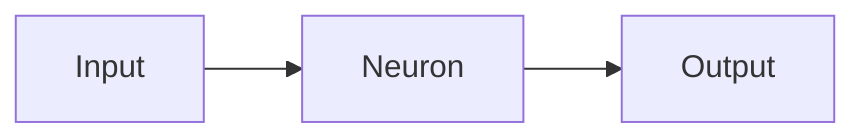
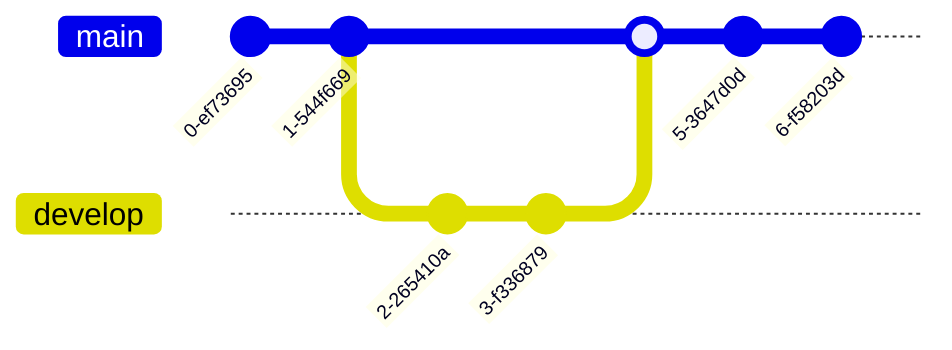
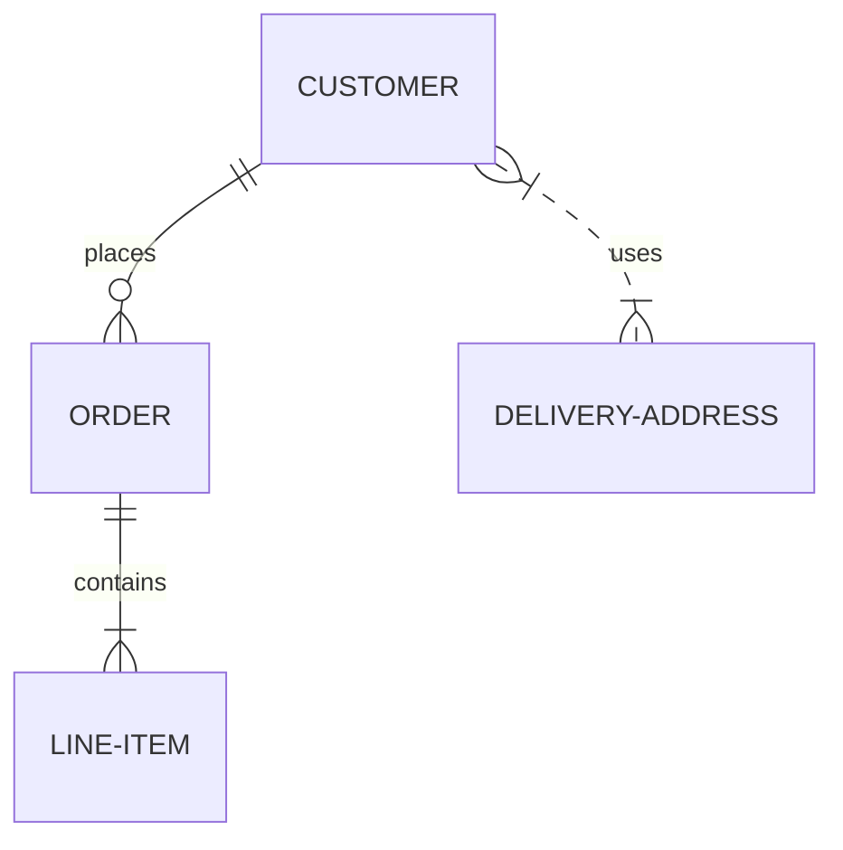

[Mermaid](https://mermaid.js.org/) lets you create visual diagrams using text and code. You can use **all diagrams** that [Mermaid supports](https://mermaid.js.org/intro/#diagram-types).

## Flowcharts

Flowcharts are composed of nodes (geometric shapes) and edges (arrows or lines).

- [Mermaid - Flowcharts documentation](https://mermaid.js.org/syntax/flowchart.html)

<UiBlock component="mermaid" title="Flowchart">



</UiBlock>
````md

````

## Gitgraph

A Git Graph is a pictorial representation of git commits and git actions(commands) on various branches.

- [Mermaid - Gitgraph Diagrams documentation](https://mermaid.js.org/syntax/gitgraph.html)

<UiBlock component="mermaid" title="Gitgraph Diagrams">



</UiBlock>
````md

````

## Entity Relationship

An entity–relationship model (or ER model) describes interrelated things of interest in a specific domain of knowledge.

- [Mermaid - Entity Relationship documentation](https://mermaid.js.org/syntax/entityRelationshipDiagram.html)

<UiBlock component="mermaid" title="Entity Relationship Diagrams">



</UiBlock>
````md

````
